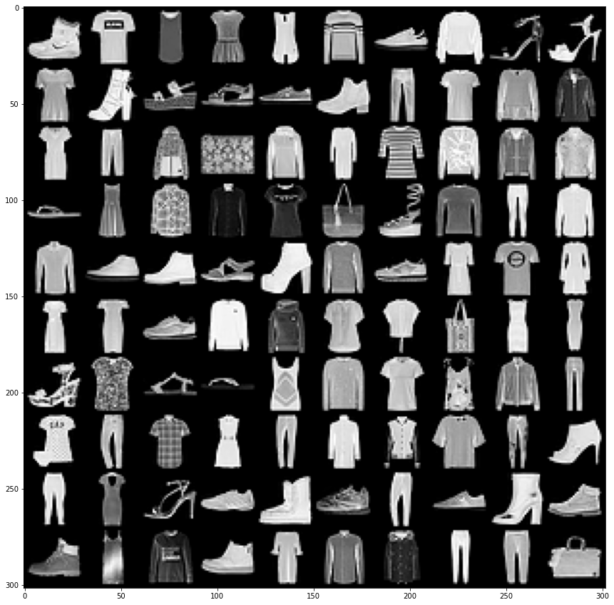

# Image-Classification-Using-PyTorch

Introduction:
A machine learning classification model that is trained on the MNIST images dataset.
During our journey we'll understand the important tools needed to develop a powerful ML model
Our aim is to play with tools like Stochastic Gradient Descent, confusion matrix, Precision, Recall, ROC curves, Area under ROC, cross validation and GridSearchCV to reach our goal.
We'll evaluate the performance of each of our classifier using confusion matrix, and also tune hyper parameters to further optimize our model
We'll validate our predictions against our test dataset and conclude our learnings
